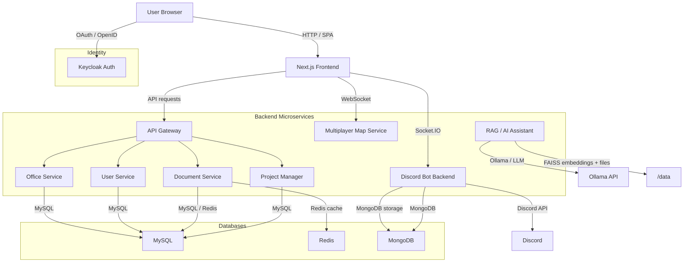

# MetaHive

MetaHive is a distributed multiplayer virtual office platform that combines a modern Next.js frontend, Spring Boot microservices, real-time map collaboration, Keycloak authentication, Discord bridge integration, and a local RAG-based AI assistant.

## Project Summary

This repository implements a hybrid collaboration workspace where team members can:

- join a shared virtual office
- manage users, teams, and meetings
- collaborate on projects, boards, and cards
- upload and serve documents
- chat through Discord integration
- interact with a real-time multiplayer map service
- use a document-aware AI assistant for file analysis and context search

The system is designed as a distributed application with separate services for user management, office management, document serving, project management, real-time state, authentication, chat integration, and AI-powered assistance.

## Architecture Overview

### Core components

- `apps/frontend` — Next.js client application
- `apps/discord-bot` — Express + Socket.IO bridge for Discord chat and persistent message storage
- `services/backend` — Gradle multi-module Spring Boot backend
  - `api-gateway` — front-door for API traffic and JWT validation
  - `office-service` — virtual office, teams, meetings, and resources
  - `user-service` — Keycloak-aware user and identity service
  - `doc-server` — document upload/download and file management with Redis support
  - `project-manager` — board/card project collaboration service
- `services/backend/multiplayer-map-service` — WebSocket-based multiplayer map server
- `services/rag-service` — Flask service for RAG document ingestion, embeddings, and Ollama-backed query responses
- `infra/keycloak` — Keycloak realm import, theme, and local authentication configuration
- `docker-compose.yml` — orchestrates all services with MySQL, Redis, MongoDB, Keycloak, and containers

### Distributed system diagram



> Note: The frontend is the user-facing entry point. The API Gateway routes requests to dedicated backend services. The map service handles live collaborative state, while the RAG service handles AI context search and file ingestion.

## Functionalities

### 1. Authentication and User Management

- Single sign-on using Keycloak with the `meta` realm
- Token-based JWT validation by the API gateway
- User profile and session management in the frontend
- OAuth / OpenID authentication flow for secure access

### 2. Virtual Office Collaboration

- Office workspace with teams, roles, meetings, and resources
- Team membership and office-role management
- Real-time office presence and interaction through the multiplayer map service
- Document and resource browsing in a shared office environment

### 3. Project and Task Management

- Boards, lists, and cards powered by `project-manager`
- Task tracking and project collaboration workflows
- File attachment and document support for projects

### 4. Document Upload and Serving

- `doc-server` exposes APIs for document upload and retrieval
- Uses Redis caching for faster document operations
- Supports image and file storage mounted by Docker volumes

### 5. Real-time Chat and Discord Integration

- `discord-bot` backend connects to Discord via bot token
- Socket.IO socket connectivity from frontend to Discord backend
- Real-time message publishing and channel room support
- Persistent chat history stored in MongoDB

### 6. Multiplayer Map Service

- Dedicated WebSocket service for map presence and state
- Live updates for avatars, location, and collaborative movement
- Separate service to isolate latency-sensitive state from REST APIs

### 7. Local RAG AI Assistant

- Flask-based `rag-service` for file ingestion and semantic search
- Extracts text from uploaded PDF, CSV, Excel, zip, and code/text files
- Builds embeddings with BERT and stores them in FAISS
- Sends context-aware prompts to an Ollama model for intelligent responses
- Supports manual context upload and query endpoints

## Getting Started

### Prerequisites

- Docker
- Docker Compose
- Optional: `DISCORD_TOKEN`, `DISCORD_GUILD_ID`, `LLAMA_API_URL`, `LLAMA_MODEL`

### Run locally

```bash
cp .env.example .env
docker compose up --build
```

Open the local services:

- Frontend: `http://localhost:3000`
- API Gateway: `http://localhost:9000`
- Keycloak: `http://localhost:8181`
- RAG Service: `http://localhost:5001`
- Discord backend: `http://localhost:4000`

### Optional environment variables

Add them to `.env` when you want optional integrations:

- `DISCORD_TOKEN` — Discord bot token
- `DISCORD_GUILD_ID` — Discord server ID
- `LLAMA_API_URL` — Ollama generate endpoint, for example `http://host.docker.internal:11434/api/generate`
- `LLAMA_MODEL` — Ollama model name, for example `llama2`
- `JWT_SECRET` — service JWT secret (default: `dev-local-secret`)

## Repository Layout

```text
apps/
  frontend/        Next.js UI client
  discord-bot/     Discord chat bridge and Socket.IO backend
services/
  backend/         Spring Boot microservice modules and API gateway
  rag-service/     Flask RAG assistant service
infra/
  keycloak/        Keycloak realm and custom theme
docs/              Product and requirement documentation
```

## Notes

- `services/backend/Dockerfile` builds all Spring Boot modules in one multi-stage pipeline
- The frontend uses `NEXT_PUBLIC_*` environment variables configured by Compose
- `docker compose down -v` removes persistent data volumes for MySQL, Redis, MongoDB, uploaded files, and RAG index state

If you want, I can also expand this README with a “developer setup” and service-specific API references.
